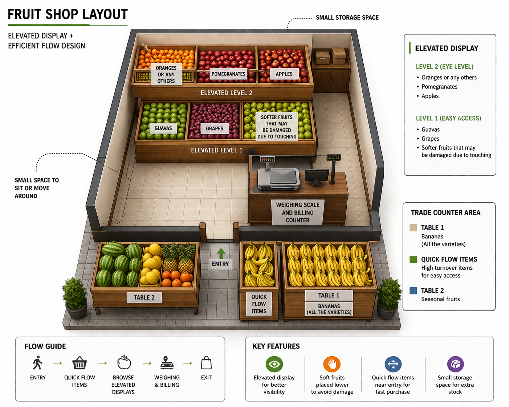

# RetailFlow AI

RetailFlow AI is a small business tool for fruit shops. It combines a Flutter point-of-sale app with a Python insights pipeline so a shopkeeper can:

- record daily fruit sales quickly
- work offline and sync later
- view demand forecasts and revenue estimates
- see festival-aware stocking advice
- place fruits on a visual shop layout using AI-driven suggestions

## Project Overview

This repo has two main parts:

- `murali_fruits_ml/`
  A Flutter app for sales entry, local draft billing, Supabase sync, and the AI Insights UI.
- `ml_pipeline/`
  A Python pipeline that reads sales data, runs basket analysis and demand forecasting, then writes insights back to Supabase.

There are also SQL setup scripts in `sql/` for the required Supabase tables and policies.

## Key Features

### Sales app

- quick fruit selection with editable weight and price
- local-first draft billing using Hive
- offline-safe transaction storage
- manual product management
- current bill panel for safer checkout

### AI insights

- 7-day revenue-oriented stock plan
- per-fruit stock suggestions
- festival and holiday alerts for Indian holidays
- smart bundle suggestions from actual sales data
- visual placement plan shown on the shop layout image

## Shop Layout View

The AI Insights tab includes a placement board built on the current layout image in the repo.



This layout is used to place fruits into zones like:

- elevated display
- table 1
- table 2
- quick flow items
- weighing and billing counter

The current implementation uses the repo image, and the UI is already structured so a real shop photo can replace it later.

## How It Works

### Data flow

1. The Flutter app records transactions locally.
2. Transactions sync to Supabase `sales_log`.
3. The Python pipeline reads sales data from Supabase and local enriched training data.
4. The pipeline creates:
   - bundle recommendations
   - 7-day stock and revenue forecasts
   - festival advice
5. The pipeline writes the final result to Supabase `daily_insights`.
6. The Flutter AI Insights tab reads the latest `daily_insights` row and renders the dashboard.

### Main tables

- `sales_log`
  Raw sales transactions from the Flutter app.
- `daily_insights`
  Generated AI output used by the app.

## Repository Structure

```text
RetailFlowAI/
├── ml_pipeline/
│   ├── data/
│   ├── models/
│   ├── enrich_data.py
│   ├── main.py
│   └── requirements.txt
├── murali_fruits_ml/
│   ├── assets/images/
│   ├── lib/
│   │   ├── data/
│   │   ├── models/
│   │   └── widgets/
│   └── pubspec.yaml
├── sql/
│   ├── setup_daily_insights_table.sql
│   └── supabase_sales_log.sql
├── INSIGHTS_SETUP.md
└── README.md
```

## Tech Stack

### Frontend

- Flutter
- Hive
- Supabase Flutter SDK
- connectivity_plus

### Backend / ML

- Python
- pandas
- Prophet
- mlxtend
- holidays
- python-dotenv
- Supabase Python client

## Setup

### 1. Supabase

Run these SQL scripts in your Supabase project:

- `sql/supabase_sales_log.sql`
- `sql/setup_daily_insights_table.sql`

That creates the required tables, indexes, and row-level security rules.

### 2. Python pipeline setup

Install dependencies:

```powershell
cd C:\projects\RetailFlowAI\ml_pipeline
python -m pip install -r requirements.txt
```

Create `ml_pipeline/.env` with your backend credentials:

```env
SUPABASE_URL=your_supabase_url
SUPABASE_SERVICE_ROLE_KEY=your_service_role_key
```

### 3. Flutter app setup

Run the app with Supabase values passed in as Dart defines:

```powershell
cd C:\projects\RetailFlowAI\murali_fruits_ml
flutter run --dart-define=SUPABASE_URL=your_supabase_url --dart-define=SUPABASE_ANON_KEY=your_supabase_anon_key
```

## Running the AI Pipeline

From the repo root:

```powershell
cd C:\projects\RetailFlowAI
python ml_pipeline/main.py
```

This will:

- fetch sales data
- run market basket analysis
- build a 7-day forecast
- generate festival-aware advice
- push the final insight record to Supabase

## Insights Produced

The `daily_insights` payload includes:

- `forecast_summary`
- `suggested_bundles`
- `stock_advice`
- `festival_advice`
- `created_at`

The app uses these to show:

- revenue-first forecast cards
- top fruits to prepare
- event-driven alerts
- bundle recommendations
- placement suggestions on the layout image

## Notes About Local Data

Local data files are intentionally ignored by Git.

Examples:

- `ml_pipeline/data/`
- `*.csv`
- local environment files like `.env`

This helps avoid committing private or generated data.

## Current Product Direction

The project is moving from a generic demo into a real shop operations tool. Recent UI work focuses on:

- safer billing flow
- stronger revenue visibility
- clearer AI trust signals
- visual merchandising guidance instead of text-only advice

## Troubleshooting

If insights are not showing up:

- make sure both Supabase SQL scripts were run
- verify `daily_insights` has fresh rows
- confirm Flutter is using the anon key
- confirm the Python pipeline is using the service role key

For more detailed setup help, see [INSIGHTS_SETUP.md](INSIGHTS_SETUP.md).

## Future Improvements

- swap the layout image with a real shop photo
- editable zone mapping from inside the app
- better per-fruit forecasting with more historical data
- richer festival-specific demand logic
- history cleanup for previously committed local data if needed

## License

No license file is currently included in this repo.
